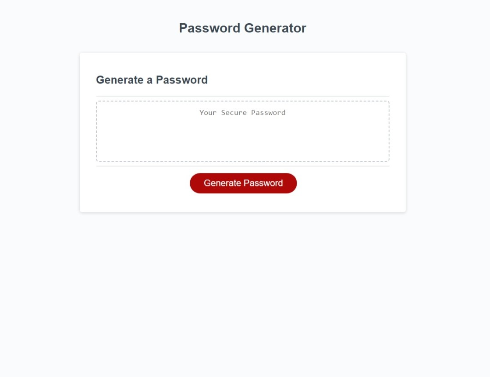

# Password Generator

## Description
This application will create a randomized password from the user input.

Deployed at https://ag6793.github.io/Password-Generator/

## Technologies
* HTML 
* CSS
* Javascript

## Installation
Clone the repository from github to access the project. No further installation is necessary.

## Usage
Click the generate password button to start the application, then answer the window prompts that appear. From the user input the application will create a password following the selected criteria. You can use the generator to create passwords without having to use the same password twice.

## Credits
* Alexandria Guerrero https://github.com/Ag6793 

## License

* [license](https://choosealicense.com/licenses/mit/)

MIT License

Copyright (c) [2023] [Alexandria Guerrero]

Permission is hereby granted, free of charge, to any person obtaining a copy of this software and associated documentation files (the "Software"), to deal in the Software without restriction, including without limitation the rights to use, copy, modify, merge, publish, distribute, sublicense, and/or sell copies of the Software, and to permit persons to whom the Software is furnished to do so, subject to the following conditions:

The above copyright notice and this permission notice shall be included in all copies or substantial portions of the Software.

THE SOFTWARE IS PROVIDED "AS IS", WITHOUT WARRANTY OF ANY KIND, EXPRESS OR IMPLIED, INCLUDING BUT NOT LIMITED TO THE WARRANTIES OF MERCHANTABILITY, FITNESS FOR A PARTICULAR PURPOSE AND NONINFRINGEMENT. IN NO EVENT SHALL THE AUTHORS OR COPYRIGHT HOLDERS BE LIABLE FOR ANY CLAIM, DAMAGES OR OTHER LIABILITY, WHETHER IN AN ACTION OF CONTRACT, TORT OR OTHERWISE, ARISING FROM, OUT OF OR IN CONNECTION WITH THE SOFTWARE OR THE USE OR OTHER DEALINGS IN THE SOFTWARE.
